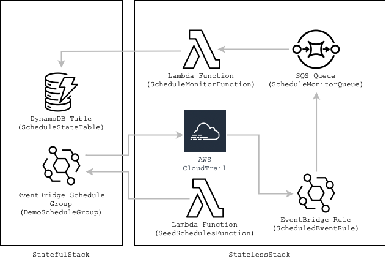

# EventBridge Scheduler Observer Pattern

A sample CDK Typescript Project that allows for querying the EventBridge Scheduled events using DynamoDB as a state store.
This is a demonstration of the Observer Pattern in Serverless Architecture.

## Description

At the core of this architecture is CloudTrail. We leverage monitoring of the EventBridge Schedule API calls:

<div align="center">
  
</div>

Independently to the core logic of the schedule creation, this service does the following steps:
1. CloudTrail picks up the EventBridge API events and they are published on the main Event Bus
2. An EventBridge rule filters for these events and pushes them to an SQS queue
3. The queue will batch the messages and send them to the `ScheduleMonitorFunction`. This Lambda will process the messages and create/update relevant records in DynamoDb

A queue is used during Step 2 because CloudTrail will not guarantee the order of events that are delivered. We need to ensure that changes are processed in order, so SQS will re-batch the messages, which are then sorted as they are processed in the `ScheduleMonitorFunction` Lambda Function.

## Installation

Ensure you have the basic setup you will need. Follow the [CDK Installation Guide](https://docs.aws.amazon.com/cdk/v2/guide/getting_started.html) to install CDK and bootstrap your target account

> Ensure that CloudTrail is enabled in your account. This is not performed by the CDK and must be done manually. In many cases, this will be managed by a centralized service such as AWS Control Tower.

Install the dependencies
```
npm install
```

Deploy the project
```
npx cdk deploy --all
```

## Configuration

## Usage

To see how this works, deploy the demo repo and run the `SeedSchedulesFunction`. This creates three scheduled events, waits a few seconds then modifies one of them and deleted one of them. This demonstrate the functionality of the solution.

```
aws lambda invoke --function-name SeedSchedulesFunction outfile.txt
```

## Cleaning Up

Remove the project when you are finished:
```
npx cdk destroy
```

## License

MIT License

Copyright (c) [2024] [Ian Brumby]

Permission is hereby granted, free of charge, to any person obtaining a copy
of this software and associated documentation files (the "Software"), to deal
in the Software without restriction, including without limitation the rights
to use, copy, modify, merge, publish, distribute, sublicense, and/or sell
copies of the Software, and to permit persons to whom the Software is
furnished to do so, subject to the following conditions:

The above copyright notice and this permission notice shall be included in all
copies or substantial portions of the Software.

THE SOFTWARE IS PROVIDED "AS IS", WITHOUT WARRANTY OF ANY KIND, EXPRESS OR
IMPLIED, INCLUDING BUT NOT LIMITED TO THE WARRANTIES OF MERCHANTABILITY,
FITNESS FOR A PARTICULAR PURPOSE AND NONINFRINGEMENT. IN NO EVENT SHALL THE
AUTHORS OR COPYRIGHT HOLDERS BE LIABLE FOR ANY CLAIM, DAMAGES OR OTHER
LIABILITY, WHETHER IN AN ACTION OF CONTRACT, TORT OR OTHERWISE, ARISING FROM,
OUT OF OR IN CONNECTION WITH THE SOFTWARE OR THE USE OR OTHER DEALINGS IN THE
SOFTWARE.

